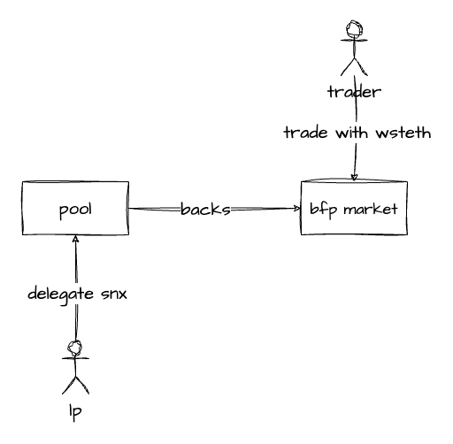

# bfp-market

**Welcome to bfp-market!**

The _big ~~fucking~~ freaking perp market_ (or just BFP-Market) is a perpetual swap market, leveraging the capabilities of Synthetix v3 as its underlying infrastructure. bfp-market inherits core features from [v2x](https://github.com/Synthetixio/synthetix/tree/develop/contracts), such as dynamic funding rates, PD (Premium/Discount) adjusted market prices, and asynchronous hybrid oracle-based order executions through [Pyth](https://pyth.network/).

In addition to these features, it also introduces various enhancements, including multi-collateral support, improved dynamic keeper fees, user-adjustable keeper fees on order commitments, improved liquidations, a host of quality-of-life improvements, a strong emphasis on gas optimization _(soon)_, and obviously built on [Synthetix v3](https://github.com/Synthetixio/synthetix-v3).

The primary use case of bfp-market is to create a hyper-stable perp derivative utilizing wstETH as collateral, allowing users to open a 1x wstETH short with minimal negative funding, completely on-chain.

Please caution as this project is **_still under active development, not yet released, or audited_**.

<p align="center">
  
</p>

_You can find more details on the working model under [`docs/images`](./docs/images/)._

## Development

```bash
# Download and install repository
git clone git@github.com:synthetixio/bfp-market.git

# Install dependencies
yarn

# Install ipfs
#
# @see: https://docs.ipfs.tech/install/ipfs-desktop/

# Install anvil
#
# @see: https://github.com/foundry-rs/foundry/tree/master/anvil

# Configure cannon locally (use default prompts)
#
# @see: https://usecannon.com/docs
npx cannon setup

# Build using cannon.
yarn build
```

## Running tests

The test environment is a composition of `bootstrap` function calls, tighly coupled with Synthetix. As such, much of the design choices follow that of Synthetix V3 for consistency. A base `bootstrap()` function is provided which does the following:

- Invokes `coreBootstrap` from Synthetix to setup base Synthetix contracts
- Creates a single staking pool with liquidity to back test markets
- Generates TypeScript interfaces and aliases for test development
- Registers and configures perp markets with the core system

All of these operates happen asynchronously in loosely chained `before` blocks. You can execute tests by:

Two primary differences to note in how tests are written in bfp-market is all tests defined in `it` blocks are isolated (ensured by the `beforeEach(restore)` rather than a `before(restore)`) and the use of [generator functions](./test) and a mixture of [realistic market parameters](./test/data) rather than hardcoded values as input data for each test.

```bash
yarn test
```
