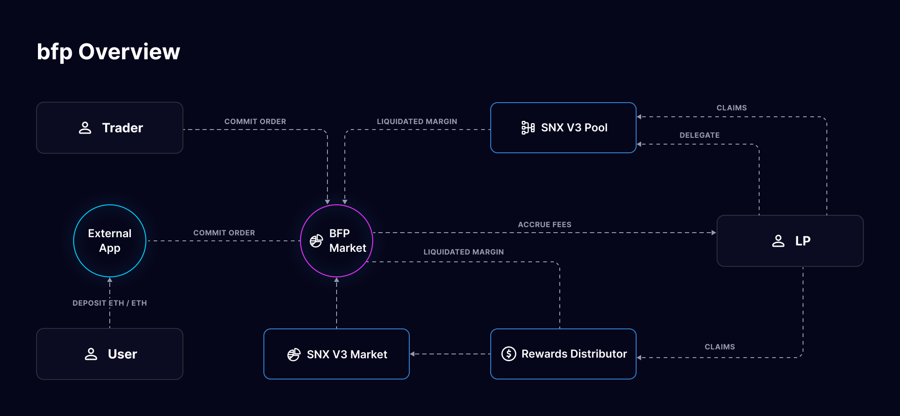

# bfp-market

**Welcome to bfp-market!**

The _big ~~fucking~~ freaking perp market_ (or just BFP-Market) is a perpetual swap market, leveraging the capabilities of Synthetix v3 as its underlying infrastructure. bfp-market inherits core features from [v2x](https://github.com/Synthetixio/synthetix/tree/develop/contracts), such as dynamic funding rates, PD (Premium/Discount) adjusted market prices, and asynchronous hybrid oracle-based order executions through [Pyth](https://pyth.network/).

In addition to these features, it also introduces various enhancements, including multi-collateral support, improved dynamic keeper fees, user-adjustable keeper fees on order commitments, improved liquidations, a host of quality-of-life improvements, a strong emphasis on gas optimization _(soon)_, and obviously built on [Synthetix v3](https://github.com/Synthetixio/synthetix-v3).

The primary use case of bfp-market is to create a hyper-stable perp derivative utilizing wstETH as collateral, allowing users to open a 1x wstETH short with minimal negative funding, completely on-chain.

<p align="center">
  
</p>

## Development

```bash
# Ensure you're in the root of project.
cd synthetix-v3

# Install monorepo dependencies.
yarn

# Generate a testable artifacts.
yarn generate-testable
yarn build-testable

# Build and run bfp-market tests.
yarn workspace @synthetixio/bfp-market {build,test,test:stable}
```
